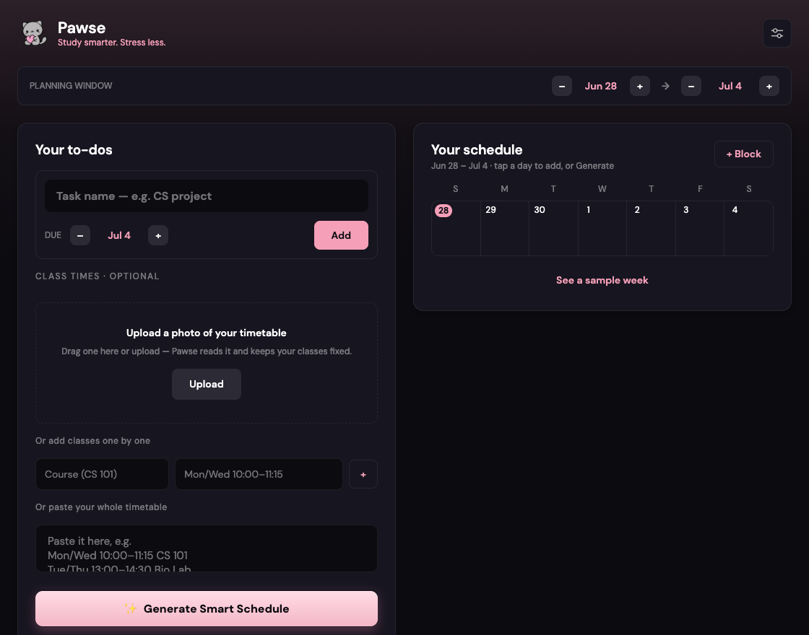
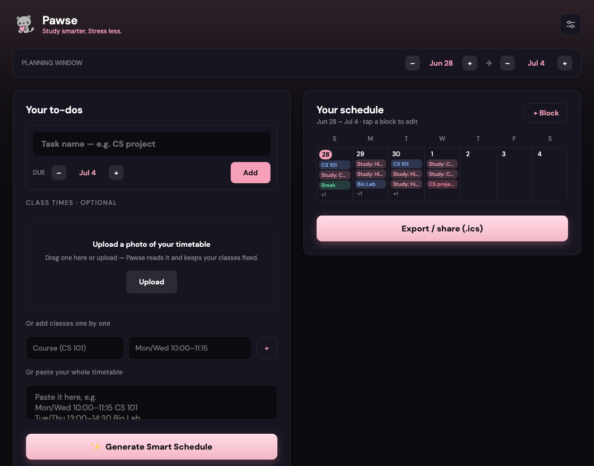
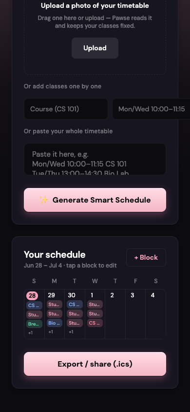

# Pawse 🐱

**Study smarter. Stress less.** Your calm in college life.

Pawse is an iOS app (Expo / React Native) where a student drops in their **class
schedule** (a photo of a timetable or typed text) plus their **tasks and
deadlines**, and an AI builds a balanced, doable **week schedule** — classes,
focused study blocks, breaks, and deadline markers — that finishes everything
before it's due. The schedule is **manually editable** (tap any block to rename,
nudge its time, move its day, or delete it). One tap exports the whole week to
**Apple Calendar**, or to **Google Calendar / anything** via a shareable `.ics`.

The UI is a single, responsive **planner**: a Tasks box and a Schedule box,
side-by-side on wide screens (iPad / web) and stacked on a phone.

This repo has two parts:

| Folder | What it is | Stack |
|---|---|---|
| `/` (root) | The iOS app | Expo SDK 56, React Native 0.85, Expo Router, TypeScript |
| `/server` | The AI backend proxy | Hono + `@fal-ai/client`, deployable to Fly/Render/any Node host |

The app **never holds an AI key**. All model calls go through the backend, which
talks to Claude (and Gemini for reading timetable photos) via fal.ai's `any-llm`
using a single `FAL_KEY` — the same pattern Martini uses.

> 📦 **To ship to the App Store, read [SHIP.md](./SHIP.md).** It's a step-by-step
> guide from "no Apple account" to "live on the App Store."

## Preview

| Plan (empty) | Plan (generated) | On a phone |
|---|---|---|
|  |  |  |

Left box: add to-dos (name + due) and classes (photo / one-by-one / paste). Right
box: an Apple-Calendar-style grid for your chosen window — empty until you
generate, then tap a day to add or a block to edit.

---

## Architecture at a glance

```
 ┌─────────────────┐        POST /api/plan         ┌───────────────────────┐
 │   Pawse app      │ ───────────────────────────▶ │  Pawse server (Hono)   │
 │ (Expo / iOS)     │  { schedule photo/text,      │                        │
 │                  │    tasks[], preferences }    │  1. photo → fal.storage│
 │  - input screen  │ ◀─────────────────────────── │     → any-llm/vision   │
 │  - week schedule │        { plan JSON }          │     (Gemini) OCR       │
 │  - chat          │                               │  2. any-llm (Claude)   │
 │  - Apple/.ics    │        POST /api/chat         │     builds plan JSON   │
 │    export        │ ───────────────────────────▶ │  3. verify hours +     │
 └─────────────────┘                                │     deadlines, repair  │
                                                     └──────────┬────────────┘
                                                                │ FAL_KEY
                                                                ▼
                                                         fal.ai any-llm
                                                      (Claude 3.5 / Gemini)
```

- **Plans are anchored to the device timezone.** Events carry wall-clock
  `date` + `start`/`end`; the app builds `Date`s with the local constructor, so
  calendar entries land at the right instant (DST-safe). See
  `src/lib/datetime.ts`.
- **The server double-checks the AI.** After Claude returns a plan, the server
  verifies every task has enough study time *and* nothing is scheduled past its
  deadline. If not, it runs one repair pass, then surfaces anything still off as
  honest **warnings** (`server/src/plan.ts`).
- **No accounts in v1.** Everything is stored locally on the device
  (`src/store/usePlanStore.ts`, AsyncStorage). This keeps App Store review simple
  — no login, no Sign-in-with-Apple requirement, no account-deletion flow.

---

## Run it locally

You need Node 20+ and the Expo tooling. Because the app uses native modules
(`expo-calendar`), it runs in a **development build** on a real device or the iOS
Simulator — **not** in Expo Go (see SHIP.md for why).

### 1. Start the backend

```bash
cd server
cp .env.example .env        # then put your FAL_KEY in .env
npm install
npm run dev                 # http://localhost:8787
```

Check it: `curl http://localhost:8787/health` → `{"ok":true,...}`.

### 2. Point the app at the backend

- **Simulator on the same Mac:** the default `http://localhost:8787` works.
- **Real iPhone:** localhost won't resolve to your Mac. Either set the server URL
  in the app's **Settings** tab to your Mac's LAN IP (e.g. `http://192.168.1.20:8787`),
  or deploy the server (SHIP.md) and use that URL.

### 3. Start the app

```bash
# from the repo root
npm install
npx expo start            # press i for iOS Simulator, or scan with a dev build
```

If you haven't made a development build yet, the first real-device run needs one:

```bash
npm i -g eas-cli && eas login
eas build --profile development --platform ios   # cloud build, no Xcode needed
# install the result on your iPhone, then:
npx expo start --dev-client
```

---

## Project layout

```
src/
  app/
    _layout.tsx            # fonts (DM Sans), dark theme, root Stack, ToastHost
    index.tsx              # the planner: Tasks box + Schedule box (responsive)
    settings.tsx           # study prefs, send feedback, server URL, clear data
  components/
    ui.tsx                 # Text/Button/Card/Chip/Screen (DM Sans, dark+pink)
    TaskComposer.tsx       # left box: NL task entry + task list
    ClassPhotoZone(.web).tsx  # always-on timetable upload (+ web drag-drop)
    SchedulePane.tsx       # right box: editable schedule + export
    WeekSchedule.tsx       # agenda view, color-coded by event type
    EventEditor.tsx        # tap a block → rename / nudge time / move day / delete
    CatMascot.tsx          # the mascot (brand artwork)
    Toast.tsx              # cross-platform toast host
  lib/
    api.ts                 # backend client (plan, feedback)
    localPlanner.ts        # on-device fallback scheduler
    parseTask.ts           # "CS project due Friday 5pm" → structured task
    calendar.ts            # Apple Calendar export (expo-calendar)
    ics.ts                 # .ics generation + share sheet (Google/universal)
    datetime.ts / taskMeta.ts / toast.ts / config.ts
  store/usePlanStore.ts    # persisted app state (Zustand)
  types/plan.ts            # shared domain types (mirror of server/src/schema.ts)
  constants/theme.ts       # design tokens (colors, fonts, spacing, radius)

server/
  src/
    index.ts               # Hono app + routes (/api/plan, /api/feedback, /health)
    plan.ts                # OCR → plan → verify → repair pipeline
    feedback.ts            # forwards in-app feedback to FEEDBACK_WEBHOOK_URL
    prompts.ts             # the system prompts (the "brain")
    fal.ts                 # fal.ai any-llm transport (FAL_KEY)
    schema.ts              # zod request/response schemas
```

## Design system

Dark-first, premium-minimal: warm near-black `#0c0b10`, one soft-pink accent
`#f5a0b8`, DM Sans, restrained radii, subtle depth, and the kawaii cat mascot.
Tokens live in `src/constants/theme.ts`. Generation/AI is never represented with
wand icons (the "✨" on the Generate button is the one intentional brand flourish).
